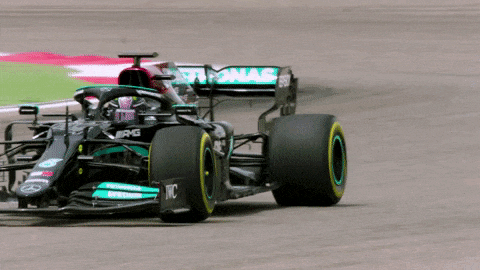

# Jazib Ahmed — Personal Portfolio Website

<p align="center">
  
</p>

<p align="center">
  A personal portfolio website built with HTML, CSS, and vanilla JavaScript.
  <br/>
  Features scroll-reveal animations, a loading screen, and interactive hover effects.
</p>

---

## 🌐 Live Sections

| Section | Description |
|--------|-------------|
| 🏠 Home | Landing page with name, navigation photos, and social links |
| 👤 About Me | Brief bio and Queen's University background |
| 🎯 Interests | Cars/F1, photography, data analysis, music, and snooker |
| 💻 Projects | Portfolio of completed and in-progress projects |

---

## ✨ Features

- **Loading Screen:** Animated pulsing logo on page load
- **Scroll Reveal Animations:** Sections fade in from different directions as you scroll
- **Hoverable GIFs:** Images on the home page animate on hover

<p align="center">
  
  &nbsp;&nbsp;
  
</p>

- **Gradient Borders:** Blue-to-purple gradient borders on all section images
- **Social Links:** LinkedIn, GitHub, and email icons with hover color transitions
- **Smooth Scrolling:** Anchor navigation scrolls smoothly between sections
- **Scroll-to-top on Reload:** Page always resets to top on refresh

---

## 🛠️ Built With

- **HTML5**
- **CSS3**  Custom animations, gradient borders, scrollbar styling
- **Vanilla JavaScript** Scroll detection, reveal logic, loading screen
- **Google Fonts** Quicksand & Cairo

---

## 📁 Project Structure

```
├── index.html
├── JazibWebsite.css
├── website.js
└── images/
    ├── logo.webp
    ├── background.webp
    ├── Own Pic.webp
    ├── f1.webp
    ├── queens.webp
    ├── projects.jpg / projects.gif
    ├── w112.jpg / w11.gif
    └── ...social icons, favicons
```

---

## 🔗 Connect

[](https://www.linkedin.com/in/jazib-ahmed-48a761213/)
[](https://github.com/jazib-17)
[](mailto:mail.jazib7537@gmail.com)
